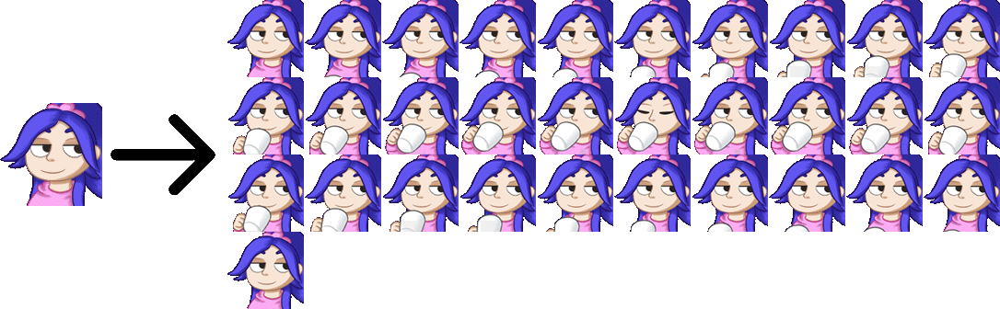

# Grite
🖌️ A command line tool to convert GIFs to sprite sheets

### What is Grite?

Grite is a very simple tool to aid with my gif avatar development. 
This program automates the progress of splitting up a gif into a spritesheet you can put straight into Unity. 

### Example

## Usage

Download the latest release from [here.](https://github.com/niallsh/Grite/releases/latest/download/Grite.exe) 
Then open up command prompt and run `Grite.exe /path/to/image.gif`. 
For example: `Grtie.exe C:\Users\Niall\Desktop\Example.gif`
